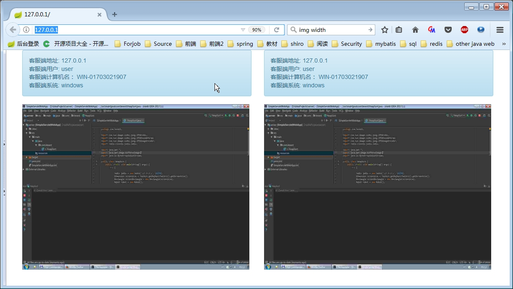

## 应用名称
Watching（基于web的屏幕实时监控）

## 技术栈	
	JDk8
	Spring
	Spring boot
	Bootstrap3
	Freemarker
	Jedis
	
## 实现思路
*	在需要监控的机子上运行client端，client端职责为，实时截屏并高压缩图片流，并对高压缩图片流转为字节存入远程redis
*	server端职责为，实时响应前端请求，同时读取redis字节并转为图片流写入当前response
*	前端负责实时ajax发送请求，并同时刷新局部页面

## 快速开始
* 本程序为maven项目，所有首先需要下载和配置好maven。http://maven.apache.org/download.cgi
* 返回本程序项目主页点击右上角按钮进行下载
* 解压项目
* 使用命令 mvn clean package构建项目
* 构建完成后一般在target\目录下会得到一个jar包，运行该jar包即可

## 部分截图
